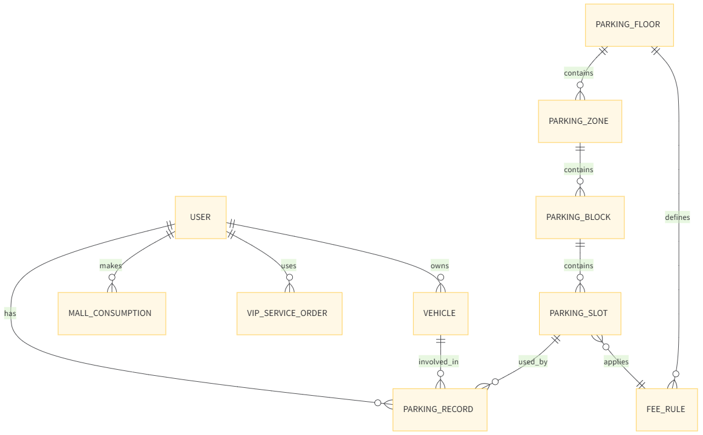

停车场系统 · 数据库概要设计版本

------

## 二、用户与权限体系

### 1️⃣ 用户表 `user`

```
user (
    id                BIGINT PK
    phone             VARCHAR
    password_hash     VARCHAR
    nickname          VARCHAR
    level             TINYINT      -- 0普通 1VIP 2超级会员
    total_consumption DECIMAL
    enter_count       INT
    is_active         BOOLEAN
    created_at        DATETIME
)

```

------

### 2️⃣ 管理员表 `admin`

```
admin (
    id            BIGINT PK
    username      VARCHAR
    password_hash VARCHAR
    role          VARCHAR
    created_at    DATETIME
)

```

------

## 三、车辆与绑定关系

### 3️⃣ 车辆表 `vehicle`

```
vehicle (
    id           BIGINT PK
    plate_number VARCHAR UNIQUE
    energy_type  TINYINT     -- 0燃油 1新能源
    user_id      BIGINT FK
    created_at   DATETIME
)

```

------

## 四、停车资源建模（核心）

### 4️⃣ 楼层表 `parking_floor`

```
parking_floor (
    id           BIGINT PK
    floor_no     INT         -- 1 / 2 / 3
    level_limit  TINYINT     -- 0普通 1VIP 2超级会员
)

```

------

### 5️⃣ 区域表 `parking_zone`

```
parking_zone (
    id          BIGINT PK
    floor_id    BIGINT FK
    energy_type TINYINT
)

```

------

### 6️⃣ 小区表 `parking_block`

```
parking_block (
    id        BIGINT PK
    zone_id  BIGINT FK
    block_no CHAR(1)         -- A / B / C / D
    capacity INT
)

```

------

### 7️⃣ 车位表 `parking_slot`

```
parking_slot (
    id          BIGINT PK
    block_id    BIGINT FK
    slot_no     VARCHAR
    fee_rule_id BIGINT FK
)

```

------

## 五、停车与计费行为记录

### 8️⃣ 停车记录表 `parking_record`

```
parking_record (
    id            BIGINT PK
    user_id       BIGINT
    vehicle_id    BIGINT
    slot_id       BIGINT
    entry_time    DATETIME
    exit_time     DATETIME
    duration_min  INT
    fee_amount    DECIMAL
    paid          BOOLEAN
)

```

------

### 9️⃣ 计费规则表 `fee_rule`

```
fee_rule (
    id             BIGINT PK
    floor_id       BIGINT
    price_per_hour DECIMAL
    free_minutes   INT
)

```

------

## 六、消费与优惠体系

### 🔟 商场消费记录 `mall_consumption`

```
mall_consumption (
    id         BIGINT PK
    user_id    BIGINT
    amount     DECIMAL
    created_at DATETIME
)

```

------

### 1️⃣1️⃣ 优惠规则表 `discount_rule`

```
discount_rule (
    id            BIGINT PK
    min_amount    DECIMAL
    discount_rate DECIMAL
)

```

------

## 七、VIP 专属服务

### 1️⃣2️⃣ 服务订单表 `vip_service_order`

```
vip_service_order (
    id           BIGINT PK
    user_id      BIGINT
    service_type TINYINT    -- 0洗车 1酒店
    status       TINYINT
    created_at   DATETIME
)

```

------

## 八、Redis 状态数据设计（概要）

```
slot:{slotId}               -> 0 / 1
floor:{floorId}:free_count  -> INT
user:{userId}:current_parking -> parking_record_id

```

------

# 概要版配套图

------

## 一、ER 图（实体关系图）



------

## 二、角色关系图（权限与功能视角）

.png)

------

## 三、停车与计费数据流图（核心业务流）

.png)

------

## 四、Redis 与数据库职责划分图

.png)

# 详细设计

这个系统里有五类“长期存在的东西”：

### 1️⃣ 人（用户 / 管理员 / 会员等级）

- **用户**：真实来停车、消费、使用服务的主体
- **管理员**：仅用于后台管理，不参与停车和消费
- **会员等级**：用户的一个“属性状态”，决定其：
  - 能停哪一层
  - 是否享受优惠
  - 是否能使用 VIP 服务

> 会员等级不是一张独立表，而是 user 的一个字段，避免过度设计。

------

### 2️⃣ 车（车牌、能源类型）

- 车是**停车的直接对象**
- 一个用户可以有多辆车
- 能源类型（燃油 / 新能源）：
  - 决定能进入哪个区域
  - 是停车资源分配的重要条件

------

### 3️⃣ 停车资源（楼层 / 区域 / 小区 / 车位）

这是一个**严格的层级结构**：

```
楼层 → 区域（能源类型） → 小区（A/B/C/D） → 车位
```

这样设计的目的：

- 支持三层停车楼
- 支持燃油 / 新能源分区
- 支持 A/B/C/D 小区独立统计容量
- 支持后期扩展更多规则，而不改表结构

------

### 4️⃣ 行为记录（进出场、停车、消费）

- 行为记录都是**事实**
- 事实只会增加，不会被修改
- 用于：
  - 计费
  - 统计
  - 管理员查看
  - 用户查询历史

------

### 5️⃣ 服务（洗车 / 酒店预约，VIP 专属）

- 这是 **“非停车主线功能”**
- 只对 VIP / 超级会员开放
- 独立建表，避免污染停车核心逻辑

------

### 原则一句话（核心架构思想）

> **状态走 Redis，事实落数据库**

- **数据库**：记录“发生过什么”
  - 谁停过
  - 停了多久
  - 花了多少钱
- **Redis**：维护“现在是什么状态”
  - 这个车位现在有没有车
  - 某一层现在还剩多少空位

避免数据库被高频状态读写拖垮。

------

## 二、用户与权限体系（字段级注释）

### 1️⃣ 用户表 `user`

```
user (
    id                BIGINT PK

```

- 用户唯一标识
- 作为所有用户相关表的外键引用

```
    phone             VARCHAR

```

- 用户登录账号
- 唯一性可在业务层或数据库层控制

```
    password_hash     VARCHAR

```

- 用户密码的哈希值
- **绝不存明文**

```
    nickname          VARCHAR

```

- 用户显示名
- 用于前端展示

```
    level             TINYINT      -- 0普通 1VIP 2超级会员

```

- 用户会员等级
- **核心权限字段**
- 决定：
  - 可进入的停车楼层
  - 是否享受优惠
  - 是否可使用 VIP 服务

```
    total_consumption DECIMAL

```

- 用户在商场的累计消费金额
- 用于：
  - 优惠判断
  - 会员升级判断

```
    enter_count       INT          -- 进入商场次数

```

- 用户进入商场（停车）的次数
- 与 total_consumption 共同作为升级条件

```
    is_active         BOOLEAN

```

- 用户是否有效
- 可用于封禁、停用账号

```
    created_at        DATETIME

```

- 用户注册时间

```
#### 设计说明
- `level` 是会员体系的**唯一权威来源**
- 不使用继承表（如 user_vip），避免 ORM 映射复杂化
- 升级规则由 **Service 层逻辑控制**

---

### 2️⃣ 管理员表 `admin`

​```sql
admin (
    id            BIGINT PK

```

- 管理员唯一标识

```
    username      VARCHAR

```

- 管理员登录账号

```
    password_hash VARCHAR

```

- 管理员密码哈希

```
    role          VARCHAR      -- 超级管理员 / 普通管理员

```

- 管理员角色
- 用于区分权限范围（如是否可修改规则）

```
    created_at    DATETIME
)

```

- 管理员创建时间

#### 设计说明

- 管理员 **不继承 user**
- 管理员不消费、不停车、不计费
- 权限模型清晰、边界明确

------

## 三、车辆与绑定关系

### 3️⃣ 车辆表 `vehicle`

```
vehicle (
    id           BIGINT PK

```

- 车辆唯一标识

```
    plate_number VARCHAR UNIQUE

```

- 车牌号
- 全系统唯一，用于识别车辆

```
    energy_type  TINYINT     -- 0燃油 1新能源

```

- 车辆能源类型
- 用于：
  - 分配停车区域
  - 判断是否允许进入某些区域

```
    user_id      BIGINT FK

```

- 车辆所属用户
- 一个用户可拥有多辆车

```
    created_at   DATETIME
)

```

- 车辆录入时间

------

## 四、停车资源建模（核心中的核心）

### 4️⃣ 楼层表 `parking_floor`

```
parking_floor (
    id           BIGINT PK

```

- 楼层唯一标识

```
    floor_no     INT         -- 1 / 2 / 3

```

- 楼层编号
- 用于展示和业务判断

```
    level_limit  TINYINT     -- 0普通 1VIP 2超级会员
)

```

- 进入该楼层的最低会员等级要求
- 决定用户是否“有资格进入该层”

------

### 5️⃣ 区域表 `parking_zone`

```
parking_zone (
    id          BIGINT PK

```

- 区域唯一标识

```
    floor_id    BIGINT FK

```

- 所属楼层

```
    energy_type TINYINT      -- 燃油 / 新能源
)

```

- 区域能源类型限制
- 用于能源分区管理

------

### 6️⃣ 小区表 `parking_block`

```
parking_block (
    id        BIGINT PK

```

- 小区唯一标识

```
    zone_id  BIGINT FK

```

- 所属区域

```
    block_no CHAR(1)         -- A / B / C / D

```

- 小区编号
- 用于管理员和用户界面展示

```
    capacity INT
)

```

- 小区理论最大车位数
- 用于统计与校验

------

### 7️⃣ 车位表 `parking_slot`

```
parking_slot (
    id        BIGINT PK

```

- 车位唯一标识

```
    block_id BIGINT FK

```

- 所属小区

```
    slot_no  VARCHAR

```

- 车位编号（如 A-001）

```
    fee_rule_id BIGINT FK
)

```

- 该车位使用的计费规则

#### 特别说明

- **车位占用状态不存数据库**
- Redis 示例：
  - `slot:{id} = 1` → 已占用
  - `slot:{id} = 0` → 空闲

------

## 五、停车与计费行为记录

### 8️⃣ 停车记录表 `parking_record`

```
parking_record (
    id            BIGINT PK

```

- 停车记录唯一标识

```
    user_id       BIGINT

```

- 停车用户

```
    vehicle_id    BIGINT

```

- 停车车辆

```
    slot_id       BIGINT

```

- 使用的车位

```
    entry_time    DATETIME

```

- 进入停车场时间

```
    exit_time     DATETIME

```

- 离开停车场时间

```
    duration_min  INT

```

- 停车时长（分钟）
- 可在出场时计算并写入

```
    fee_amount    DECIMAL

```

- 实际停车费用

```
    paid          BOOLEAN
)

```

- 是否已完成缴费

------

### 9️⃣ 计费规则表 `fee_rule`

```
fee_rule (
    id          BIGINT PK

```

- 计费规则唯一标识

```
    floor_id    BIGINT

```

- 适用楼层

```
    price_per_hour DECIMAL

```

- 每小时收费标准

```
    free_minutes   INT
)

```

- 免费停车时间（如前 30 分钟免费）

------

## 六、消费与优惠体系

### 🔟 商场消费记录 `mall_consumption`

```
mall_consumption (
    id         BIGINT PK
    user_id    BIGINT
    amount     DECIMAL
    created_at DATETIME
)

```

- 记录用户在商场内的消费行为
- 用于：
  - 优惠判断
  - 会员升级判断

------

### 1️⃣1️⃣ 优惠规则表 `discount_rule`

```
discount_rule (
    id            BIGINT PK
    min_amount    DECIMAL

```

- 达到优惠所需最低消费

```
    discount_rate DECIMAL
)

```

- 优惠比例（如 0.8 表示 8 折）

------

## 七、VIP 专属服务

### 1️⃣2️⃣ 服务订单表 `vip_service_order`

```
vip_service_order (
    id          BIGINT PK
    user_id     BIGINT

```

- 服务所属用户

```
    service_type TINYINT    -- 0洗车 1酒店

```

- 服务类型

```
    status      TINYINT     -- 处理中 / 已完成

```

- 服务处理状态

```
    created_at  DATETIME
)

```

------

## 八、Redis 键含义说明

```
slot:{slotId} -> 0 / 1

```

- 车位是否被占用

```
floor:{floorId}:free_count

```

- 当前楼层剩余空车位数

```
user:{userId}:current_parking

```

- 用户当前是否在停车中（防重复入场）

------

## 九、类与表映射说明

这是 **ORM 层的直接映射关系**，方便代码理解：

| 领域对象      | 数据库表          |
| ------------- | ----------------- |
| User          | user              |
| Admin         | admin             |
| Vehicle       | vehicle           |
| ParkingSlot   | parking_slot      |
| ParkingRecord | parking_record    |
| FeeRule       | fee_rule          |
| Consumption   | mall_consumption  |
| VipService    | vip_service_order |